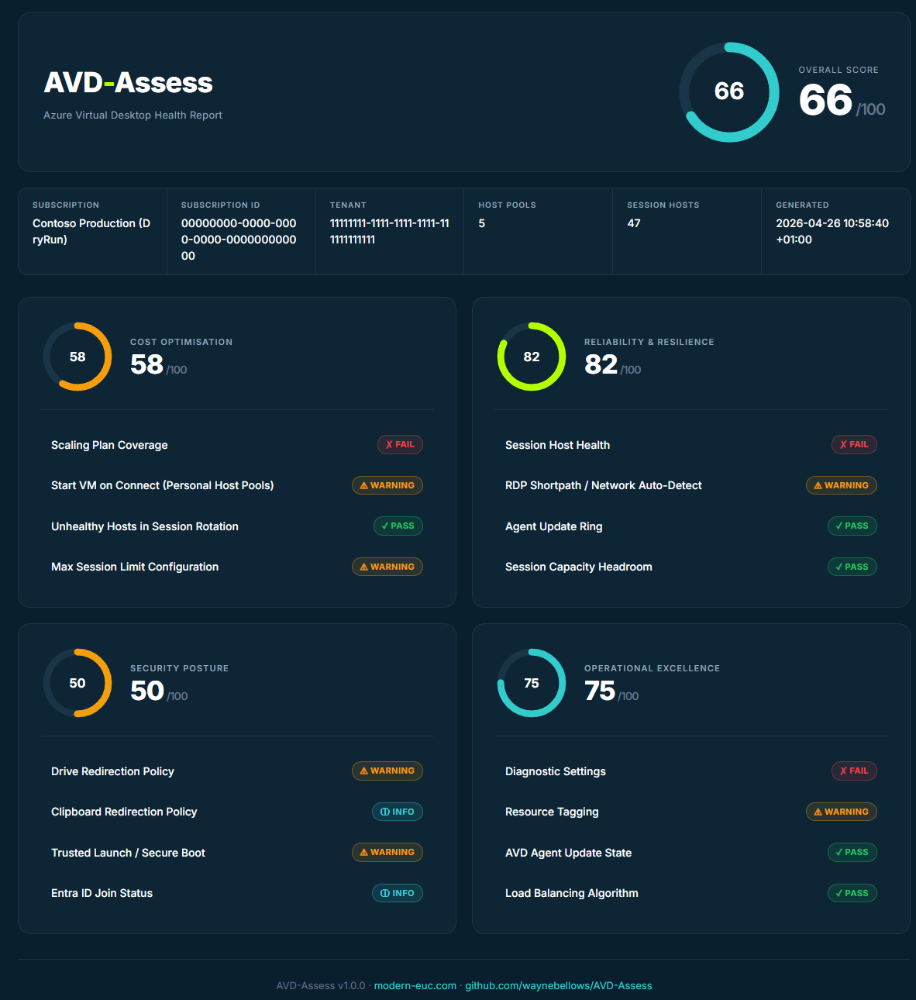

# AVD-Assess

**A free, open-source PowerShell health checker for Azure Virtual Desktop.** Connects to your subscription, runs 16 best-practice checks across Cost, Reliability, Security, and Operations, and produces a self-contained HTML report with traffic-light scoring and remediation guidance.

## Why this exists

There is no free, open-source, automated health checker for AVD. Microsoft's Well-Architected Framework for AVD is thorough documentation, but operationalising it means either paying for a commercial tool, running a manual review, or doing nothing. AVD-Assess turns the guidance into a five-minute script that produces a shareable report.



## What it checks

**Cost Optimisation** — scaling plan coverage, Start VM on Connect, unhealthy hosts still in rotation, max session limit configuration.

**Reliability & Resilience** — session host health, RDP Shortpath configuration, agent update ring split, session capacity headroom.

**Security Posture** — drive redirection policy, clipboard redirection, Trusted Launch / Secure Boot, Entra ID join status.

**Operational Excellence** — diagnostic settings, resource tagging, AVD agent update state, load balancing algorithm review.

Every finding names the affected resources, explains the fix in concrete terms, and links to the relevant Microsoft Learn article.

## Prerequisites

- **PowerShell 7+** — [download from Microsoft](https://learn.microsoft.com/powershell/scripting/install/installing-powershell)
- **Az PowerShell modules** — `Az.Accounts`, `Az.DesktopVirtualization`, `Az.Compute`, `Az.Monitor`, `Az.Resources`
- **Azure permissions** — Reader on the subscription is enough. If you prefer least privilege: *Desktop Virtualization Reader* on the AVD resource groups + *Reader* on the compute resource groups containing session hosts.

## Quick start

```powershell
# Install required modules (one-time)
Install-Module Az.Accounts, Az.DesktopVirtualization, Az.Compute, Az.Monitor, Az.Resources -Scope CurrentUser

# Clone the repo
git clone https://github.com/waynebellows/AVD-Assess.git
cd AVD-Assess

# Run against your current Azure context
./AVD-Assess.ps1 -OpenReport
```

The script signs you in (unless `-UseExistingConnection` is used), collects AVD data, runs the 16 checks, and writes `AVD-Assess-Report-<timestamp>.html` to the current directory.

## Running from Azure Cloud Shell

AVD-Assess works in [Azure Cloud Shell](https://shell.azure.com) (PowerShell mode) — no local install, and you're already signed in to your tenant.

```powershell
# 1. Install the one module Cloud Shell doesn't ship by default
Install-Module Az.DesktopVirtualization -Scope CurrentUser -Force

# 2. Download the script into your persistent Cloud Drive
curl -o ~/clouddrive/AVD-Assess.ps1 https://raw.githubusercontent.com/waynebellows/AVD-Assess/main/AVD-Assess.ps1

# 3. Run it against your current Cloud Shell context
~/clouddrive/AVD-Assess.ps1 -UseExistingConnection -OutputPath ~/clouddrive/avd-assess.html
```

Then use **Manage files &rarr; Download** in the Cloud Shell toolbar to grab `avd-assess.html` and open it locally.

**Notes:**
- Use `-UseExistingConnection` — Cloud Shell is already authenticated.
- Omit `-OpenReport` — there's no browser inside Cloud Shell.
- Writing to `~/clouddrive` keeps the report across sessions.

## Parameters

| Parameter | Description | Example |
|---|---|---|
| `-SubscriptionId` | Azure subscription ID to assess. Falls back to the current Az context. | `00000000-0000-0000-0000-000000000000` |
| `-TenantId` | Azure tenant ID. Falls back to the current Az context. | `11111111-1111-1111-1111-111111111111` |
| `-OutputPath` | Path for the HTML report. Defaults to the current directory with a timestamp. | `C:\Reports\avd.html` |
| `-HostPoolName` | Scope the assessment to a single host pool (requires `-ResourceGroupName`). | `hp-prod-pooled-01` |
| `-ResourceGroupName` | Scope the assessment to a specific resource group. | `rg-avd-prod` |
| `-UseExistingConnection` | Skip `Connect-AzAccount` and use the existing Az context. Useful for automation. | *switch* |
| `-OpenReport` | Open the HTML report in the default browser when complete. | *switch* |

## Examples

```powershell
# Full subscription, open the report when done
./AVD-Assess.ps1 -SubscriptionId "00000000-0000-0000-0000-000000000000" -OpenReport

# Single host pool
./AVD-Assess.ps1 -HostPoolName "hp-prod-pooled-01" -ResourceGroupName "rg-avd-prod"

# Automation-friendly (already authenticated)
./AVD-Assess.ps1 -UseExistingConnection -OutputPath "C:\Reports\avd-health.html"
```

## How the scoring works

Each check returns a status and a 0–100 score:

- **Pass** (green) — meets best practice. Score 100.
- **Warning** (amber) — partial gap or non-critical issue. Score 40–80.
- **Fail** (red) — significant cost, reliability, or security risk. Score 0–40.
- **Info** (teal) — not applicable or informational only. Excluded from category averages.

**Category score** = average of non-Info checks in that category. **Overall score** = average of the four category scores.

## Contributing

Bug reports, new checks, and report design improvements are all welcome. See [CONTRIBUTING.md](CONTRIBUTING.md) for the data model and style guidance.

## License

[MIT](LICENSE) — use, modify, and redistribute freely.

---

Built by [Wayne Bellows](https://modern-euc.com) · Feedback: wayne_bellows@hotmail.com
